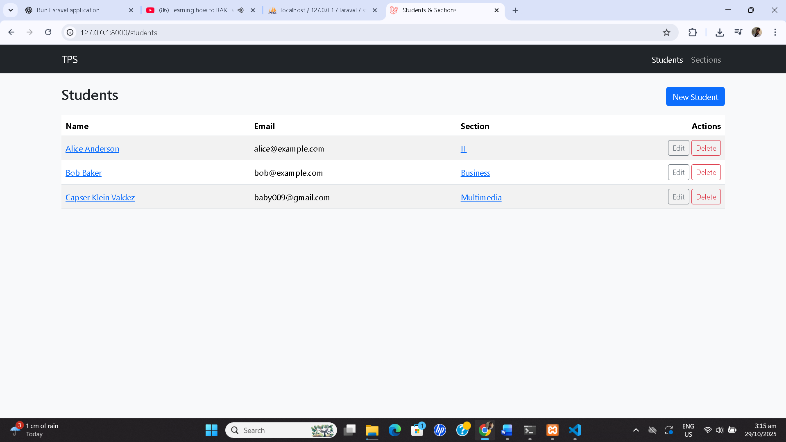
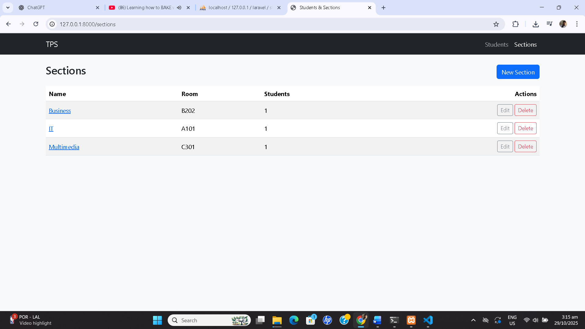
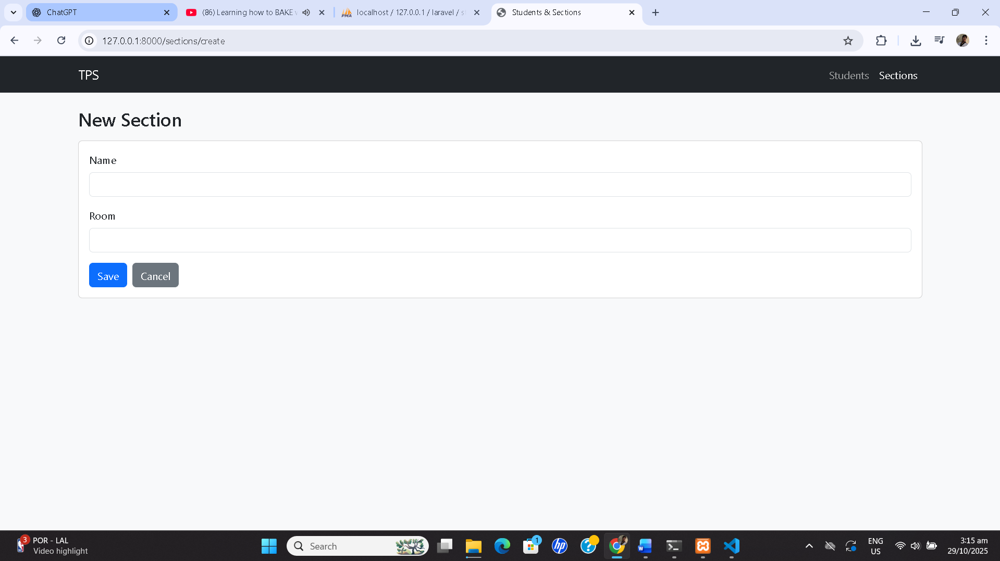
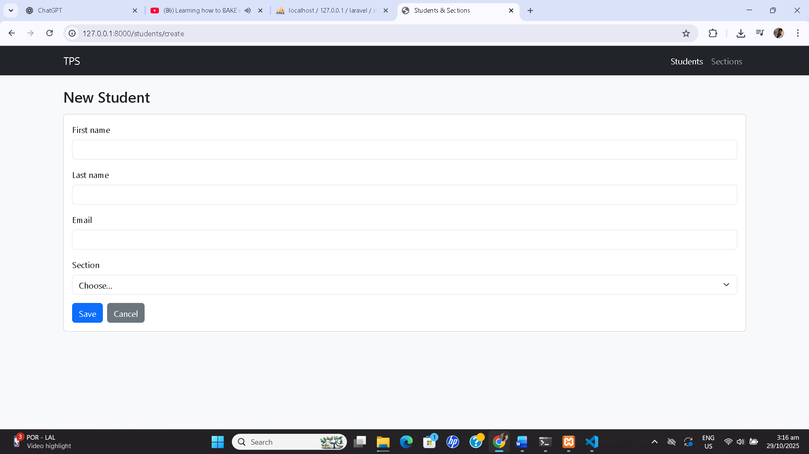
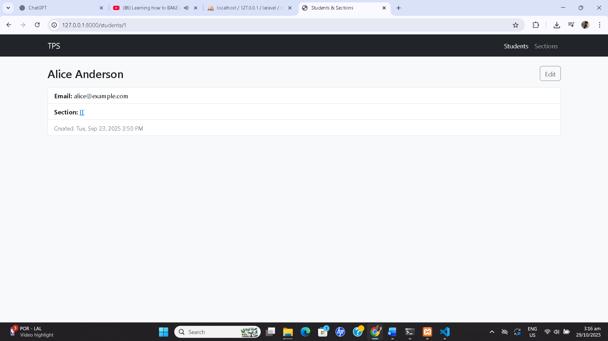
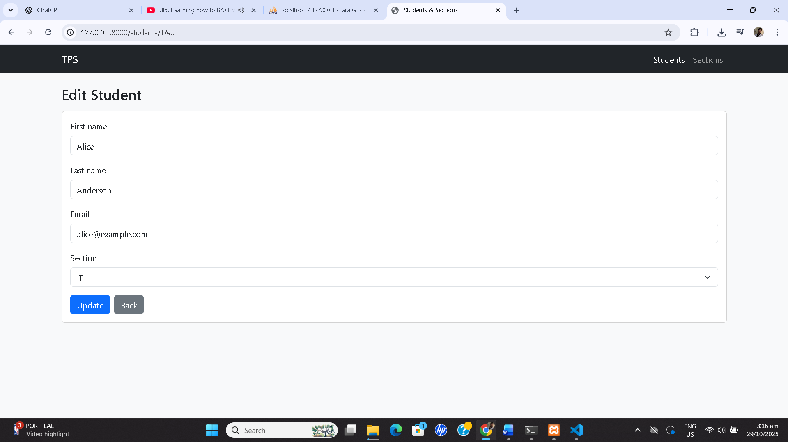
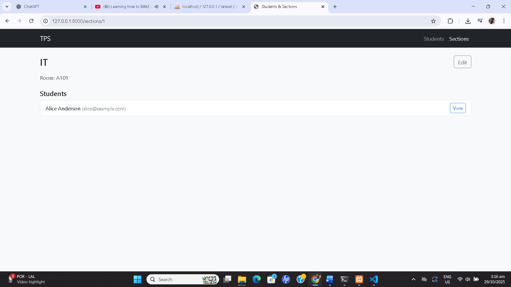

# 🎓 Student & Section Management System (TPS)

## 📖 Description / Overview
The **Student & Section Management System** is a web-based CRUD application developed using the **Laravel Framework**.  
It allows users to manage student and section information efficiently — including adding, editing, deleting, and viewing records.  
The system demonstrates the use of Laravel’s **MVC architecture**, **Blade templating**, and **Eloquent ORM relationships** between students and sections.

---

## 🎯 Objectives
- To create a functional web-based CRUD system using Laravel.  
- To apply MVC architecture in developing dynamic applications.  
- To demonstrate **one-to-many relationships** between models using Eloquent ORM.  
- To practice the use of Blade templates for clean and reusable layouts.  
- To gain experience managing database migrations and routes in Laravel.  

---

## ⚙️ Features / Functionality
### 👩‍🎓 Student Management
- Add new students with first name, last name, email, and section.
- View all students in a tabular list.
- Edit or delete existing students.
- View individual student profiles.
- Link between a student and their assigned section.

### 🏫 Section Management
- Create new sections with name and room number.
- View all sections and their assigned students.
- Edit or delete sections.
- See the total number of students per section.

### 🔗 Relationships
Implements **One-to-Many Relationship**:
```php
// In Section model
public function students() {
    return $this->hasMany(Student::class);
}

// In Student model
public function section() {
    return $this->belongsTo(Section::class);
}
```

---

## 🧩 Installation Instructions
Follow these steps to set up and run the project on your local environment:

```bash

# 1. Navigate to the project folder
cd students-sections

# 2. Install dependencies
composer install

# 3. Copy the example environment file
cp .env.example .env

# 4. Configure your database in the .env file
DB_DATABASE=laravel
DB_USERNAME=root
DB_PASSWORD=

# 5. Generate the application key
php artisan key:generate

# 6. Run migrations to create database tables
php artisan migrate

# 7. Start the Laravel development server
php artisan serve
```

Then open your browser and go to:
```
http://127.0.0.1:8000
```

---

## 🧠 Usage
1. Click **Students** on the top navigation bar to manage student records.  
2. Click **New Student** to add a new student.  
3. Click **Sections** to manage section details.  
4. Use the **Edit** and **Delete** buttons to modify or remove records.  
5. Click on a **student** or **section** name to view more details.  

---

## 🖼️ Screenshots

### 1. Students List


### 2. Sections List


### 3. New Section Form


### 4. New Student Form


### 5. Student Details


### 6. Edit Student


### 7. Section Details


---

## 💻 Code Snippets

### Laravel Relationship Example
```php
// Student.php
public function section() {
    return $this->belongsTo(Section::class);
}

// Section.php
public function students() {
    return $this->hasMany(Student::class);
}
```

### Command to Run Server
```bash
php artisan serve
```

---

## 👩‍💻 Contributors
- **Stephen Karl B. LAcasandile** — Developer  
- *(Add partner’s name if applicable)*  

---

## ⚖️ License
This project is created for **educational purposes only** as part of a midterm examination.  
Distributed under the **MIT License**.

---

## 🏁 End of Documentation
